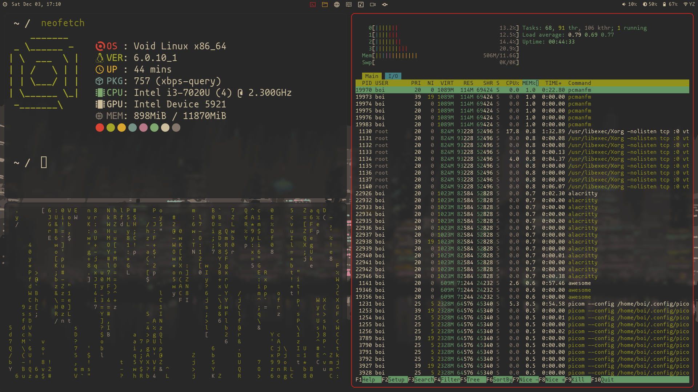
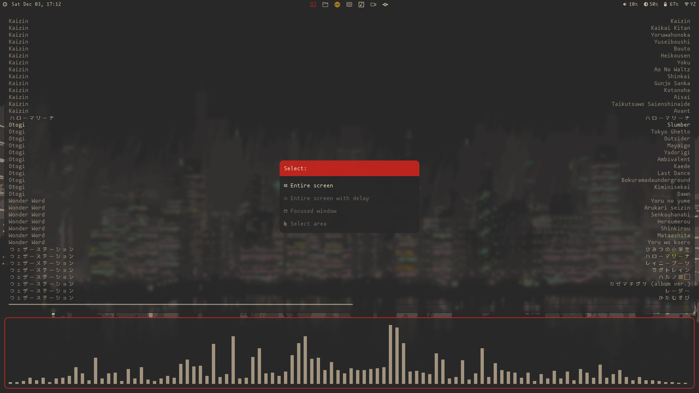
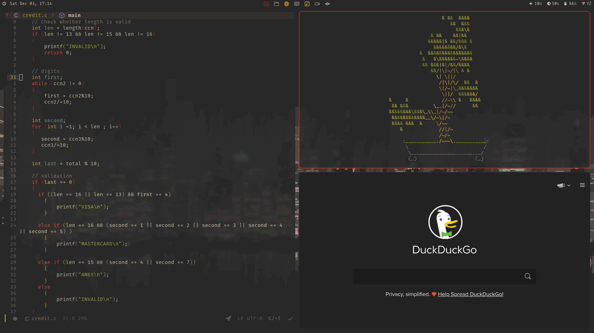

# dotfiles
This is just a personal repository where i store all my dotfiles, you’re free clone them(Most of this is not mine) and edit them as you wish.

## The amazing people I stole from
- [d41rus-drk](https://github.com/d4r1us-drk/dotfiles) made the base of these dotfiles and I would highly their Awesomewm setup.
- Distrotube for [emacs](://gitlab.com/dwt1/dotfiles/-/tree/master/.emacs.d.gnu)
- System Crafters for [emacs](https://github.com/daviwil/emacs-from-scratch)

## Dependencies
This system was installed on [void linux](https://voidlinux.org/)

- AwesomeWM-git (and its build [dependencies](https://github.com/awesomeWM/awesome))
- Network Manager
- Light
- Pipewire (as pulse instance or just pulseaudo)
- rofi
- zsh
- picom
- Alacritty or Urxvt.

# Optional depedencies
- Qutebrowser
- Pcmanfm
- lf
- Emacs
- [GTK and icons](https://github.com/TheGreatMcPain/gruvbox-material-gtk)
