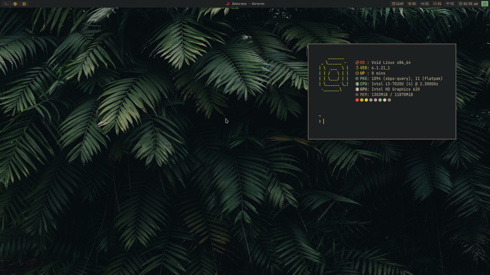
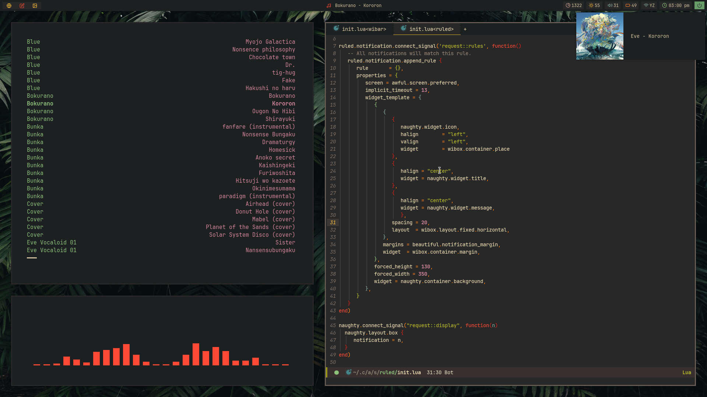

# Dots
This is just a personal repository where i store all my dotfiles, you’re free clone them and edit them as you wish.

## Dependencies
This system was installed on [void linux](https://voidlinux.org/)

- awesomeWM-[git](https://github.com/awesomeWM/awesome)
- st
- sx(start xorg session)
- iwd (wifi)
- brillo (brightness)
- Pipewire (as pulse instance or just pulseaudo)
- rofi
- zsh
- picom

# Optional depedencies
- firefox
- lf
- emacs
- [GTK and icons](https://github.com/Fausto-Korpsvart/Gruvbox-GTK-Theme)
